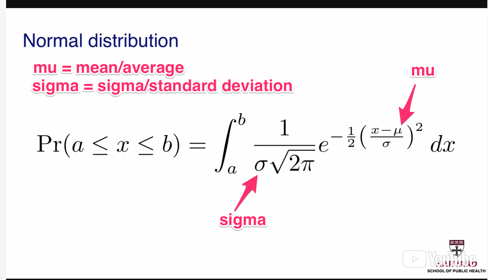
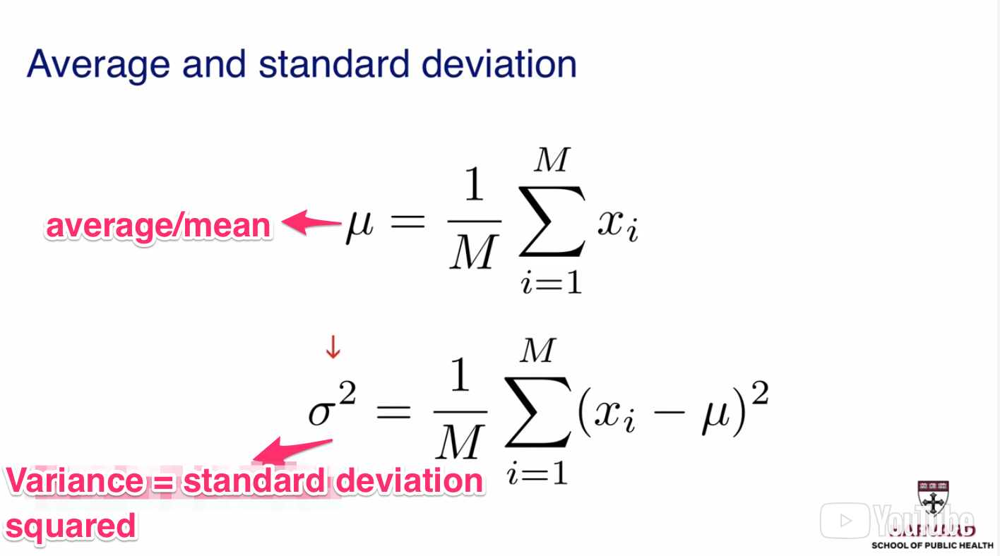
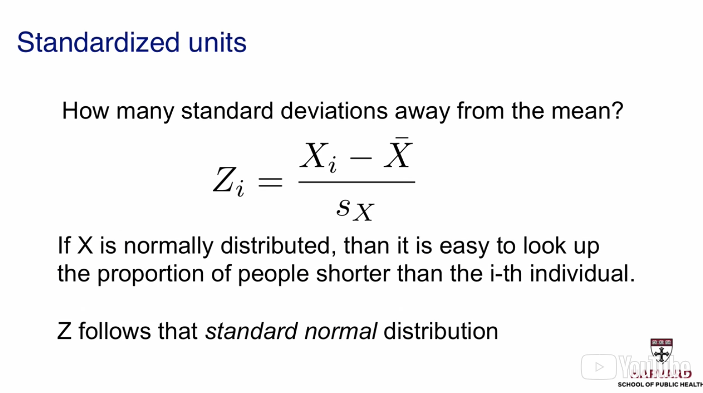

```{r setup, include=FALSE}
knitr::opts_chunk$set(echo = TRUE)
```

```{r message=FALSE}
library(downloader)
library(tidyverse)

url <- "https://raw.githubusercontent.com/genomicsclass/dagdata/master/inst/extdata/femaleMiceWeights.csv"
female_mice_weights <- paste0("data/", basename(url))
download(url, destfile = female_mice_weights, quiet = TRUE)
```

#### Motivation  
Say we want to understand how diet relates to body weight increase, and we perform an experiment where we take a sample of rats and feed some high fat diet, the others a normal diet, and we notice some differences in body weight between these two. So take for example;  
```{r, message=FALSE}
data <- read_csv(female_mice_weights)
head(data)
control <- filter(data, Diet == "chow") %>% select(Bodyweight) %>% unlist
treatment <- filter(data, Diet == "hf") %>% select(Bodyweight) %>% unlist
```
Now we have both samples, if we compare them, we see that sometimes (not all the time), the body weight of the high fat mouse is bigger than the control, but here we want to compare the average, so on average, does high fat diet mean heavier mouse?  

```{r}
mean(treatment)
mean(control)
mean(treatment) - mean(control) 
```

We see on average that the treatment mice does have a heavier weight 

#### Introduction to Random variables  

```{r echo=FALSE, message=FALSE}
url <- "https://raw.githubusercontent.com/genomicsclass/dagdata/master/inst/extdata/femaleControlsPopulation.csv"
weights_control_pop <- paste0("data/", basename(url))
download(url, destfile = weights_control_pop, quiet = TRUE)
```

Now, from the previous exercise, we saw that the weight of the treatment and control mice differs by about 3 grams, we call these kind of values random because its computed from a sample. In the real life, we barely get access to the whole population data, like the full population weights of mice in this example. To simulate this, I've downloaded the population data of the control mice (we've been using a sample of this data so far). Now being a random variable means that, each time we compute a statistic of a sample of the population, we get a different statistical value, for example, each time we calculate the mean of a sample from the population data here, we get a different value;  

```{r}
population <- read.csv(weights_control_pop)$Bodyweight
for(i in 1:5) {
  print(mean(sample(population, 12)))
}
```
From the above, we see that we're always getting different values, and this explains why we said that the difference we noticed in the treatment and control mice is a random variable, because it was computed from a sample, and this applies most times to research results, because its usually the case that the experiment wasn't performed on the whole population, but a sample of the population.

Given that the value we get is a random variable from our experiment, statistical inference helps us answer the question if the difference we noticed was due to the high fat diet, or just random chance. 

#### Introduction to Null Distribution  

The null hypothesis is a question we ask that, the difference we observe between samples isn't as a result of the cause we attribute it to, that is, there's no significant difference between specified samples and any difference we observe is due to sampling/experimental errors, just random values and not significant. 
We'll like to test if the difference we observed between treatment and control mice was significant or not. So to do this, we test the Null hypothesis, which is that there's no significant difference and what we observed was due to chance, we'll use a null hypothesis distribution to test this, what that means is that 

```{r}
actual_observation <- mean(treatment) - mean(control)

new_control <- sample(population, 12)
new_treatment <- sample(population, 12)
new_mean <- mean(new_treatment) - mean(new_control)
```

We take new samples from the control population (fed the same diet), and since we're testing the null hypothesis, we create new treatment and control samples from this population, then we check the mean difference. We do this several times to get the null distribution; 

```{r}
set.seed(5)
mice_null_distribution <- sapply(1:10000, function(x) {
  new_control <- sample(population, 12)
  new_treatment <- sample(population, 12)
  mean(new_treatment) - mean(new_control)
})
```

Above, I've created the null distribution of the mice data, remember that the goal is to see how common it is to find the difference we observed with our experiment to see if its significant or not, using samples fed the same diet (from the same population).

```{r message=FALSE}
max(mice_null_distribution) # 5.10, which is actually bigger than the observation we saw in our experiment. Interesting.

ggplot(data.frame(weights = mice_null_distribution), aes(x = weights)) +
  geom_histogram(aes(fill = ..count..)) +
  scale_fill_gradient("Count", low = "green", high = "red") +
  ggtitle("Histogram of Nulls")
```

A histogram is a useful plot used to explore the distribution, we see that most of the data lies between -2 and 2. This gives us a picture of how likely it is to observe the difference we did in our experiment. To compute how likely it is to find such observation as we did in our experiment, what we do is to calculate the proportion of times we find that observation from the null distribution  

```{r}
mean(mice_null_distribution > actual_observation)
```
From the above, we see that observing a difference like we did in our experiment only happens about 1.3% of the time in the population, which isn't very common. We can also compute how often it is big enough in absolute values, which is about 2.6%. 

```{r}
mean(abs(mice_null_distribution) > actual_observation)
```

That 2.6% is the p-value. It is the probability that an outcome from the null distribution is bigger than what we observed when the null hypothesis is true. So this p-value is considered small enough to be reported (in scientific literature), and therefore we reject the null hypothesis that the observed difference is not significant. So why we can compute the null distribution in this example, we should note that this isn't always possible in real life because we usually don't get access to the full population from which our experimental sample is drawn, so we need to know how to compute these p-values without having access to the entire population.  

#### Probability Distributions  
Distributions of data gives us a number of information of the data we're working with. For example, given the distribution, we can tell the proportion below any point, and with that information, we can tell how many values are within any interval. So if we can describe the distribution, we can describe the entire data Given a distribution, we can plot the **Emperical Cumulative Distribution Function**, which shows us the f(x) for any x, where x is the height for example, and f(x) is the proportion. Knowing the distribution of a population answers the question of what is the probability of picking a value randomly that matches a given spec.  Given this information, take for example we have a distribution of height, we can answer the question what is the probability of an individual being shorter than a given height.  

#### Bell Curve (Normal/Gaussian Distribution) 
The formula that describes a normal distribution is 

There are two numbers that are important to define a Normal distribution. These are the mean and the standard deviation. So if a list of numbers follows a normal distribution, and we know mu (mean/average) and sigma (standard deviation), then we can answer the question what is the proportion of x that's between any a and b value. For example, if the distribution of your data is approximated by a normal distribution, then we'll know that the 95% of the data is within 2 standard deviations from the average, 99% is within 2.5 standard deviations from the average, and 68% is within 1 standard deviations from the average. 
  

A quantile-quantile (q-q) plot is useful to see if two data sets comes from a population with a common distribution. A q-q plot is a plot of quantiles of the first data set against the quantiles of the second dataset. A quantile is a fraction/percent of points below a given value, so for example, 0.7 (70%) quantile is the point at which 70% of the data fall under, and the remaining 30% fall above.  For a normal distribution, on the x axis we plot the percentiles of a normal distribution, and on the y axis we plot the percentiles of our data set. If they both have the same distribution, then the points should fall on the identity line.

##### Standard Units  
If you know your data is approximated by a normal distribution, one good strategy is to convert to standard units.  
  
If we compute the standard units, then we're saying for each point, how many standard deviations we are from the mean. The value we get when we do this calculation in the formula above for every value is called a z-score. So if we convert the data to z-scores, if a value has a z-score of 2, we know that its a big score, because only 5% of the data is 2+ standard deviations away from the mean.  

#### Populations, Parameters, and sample estimates.  
The idea behind statistical inference is that we can take a sample data, from which we're going to infer something from, without having to rely on the entire population, or take multiple measurements. So take for example we want to compare the height of men and women and check on average if men are taller than women, so since we don't have the entire population to measure the averages for both gender and answer our question, we take a sample, after taking the samples list from each gender, we can now compare both averages and we notice a difference in the average, now this difference we noticed is a random variable, because if we take new samples from the population, and calculate the average difference from both samples averages (male and female), we'll get a different value each time. Statistical inference helps us know how different this difference could be if we keep taking more samples (without actually really taking more samples), i.e how close is the sample average from the population average.

##### Central Limit Theorem (CLT)  
The CLT tells us that the sample average follows a normal distribution. Basically, what the CLT is telling us is; given that the sample average is a random value, if we keep taking samples from the population, the distribution of these sample averages becomes normally distributed, and the bigger the size of our sample, the smaller the spread. Problem here is that this would need the population, which we usually don't have access to. I tested this above when I created the null distribution of the samples and visualized this using a histogram, which showed that it was indeed a bell curve histogram. Another way I can use to test if my distribution follows a normal distribution is by using qqnorm and qqline to plot the qqplot and line of this distribution with a theoritical normal distribution and I would see how much my distribution follows a normal distribution. If we can establish that a null distribution is normally distributed, this provides a good foundation for making further inference based on the characteristics of CLT. One important thing we can do is to obtain p-values and confidence intervals using the CLT and the t-statistic, which is important because now we are getting important values without having to depend on the population so we can repeat our experiments many times.  

##### T-tests  
```{r}
# get the treatment and control subjects
control <- filter(data, Diet == "chow") %>% select(Bodyweight) %>% unlist
treatment <- filter(data, Diet == "hf") %>% select(Bodyweight) %>% unlist

N <- length(treatment)

# Observed difference between treatment and control
observed_difference <- mean(treatment) - mean(control)

standard_error <- sqrt(
  var(treatment) / N + var(control) / N 
  )
# the t statistic value
(t_stat <- observed_difference / standard_error)
```

What the t-statistic together with the CLT is telling us is that **the null distribution is approximated by a normal distribution with mean 0 and variance 1**. With this, we can compute p-values using the `pnorm` function which tells us what proportion of normally distributed data (data with mean 0 and standard deviation 1) are lower than whatever data we pass into it as input, so to get out p-value, we do  
```{r}
(p_value <- 2 * (1 - pnorm(t_stat)))
```

If the sample size is small, and we compute the null distribution and check how that conforms with a normal distribution using `qqnorm`, we might get a visualisation that shows that its not, becuase of the small sample size, which would result to more spread in our data which would affect the distribution. If we believe that our data can be approximated by a normal distribution, then we can use the t-statistic to get p-values. In practice, to perform the t-test, we do the following  
```{r}
(t_test <- t.test(treatment, control))
```

The above would give us the t statistic, the p-value, and the confidence interval. Performing the t-test as above using the default function isn't done with the assumption that the CLT applies (it uses a t-distribution), so for that reason the p-value is different as the t-distribution is more spread than the normal distribution. This makes sense because if we look at the `qqnorm` and `qqline` of both control and treatment, it might match or slightly match, so the t-distribution might give us a good approximation of the actual situation.  


